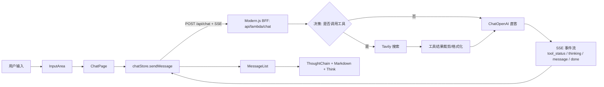
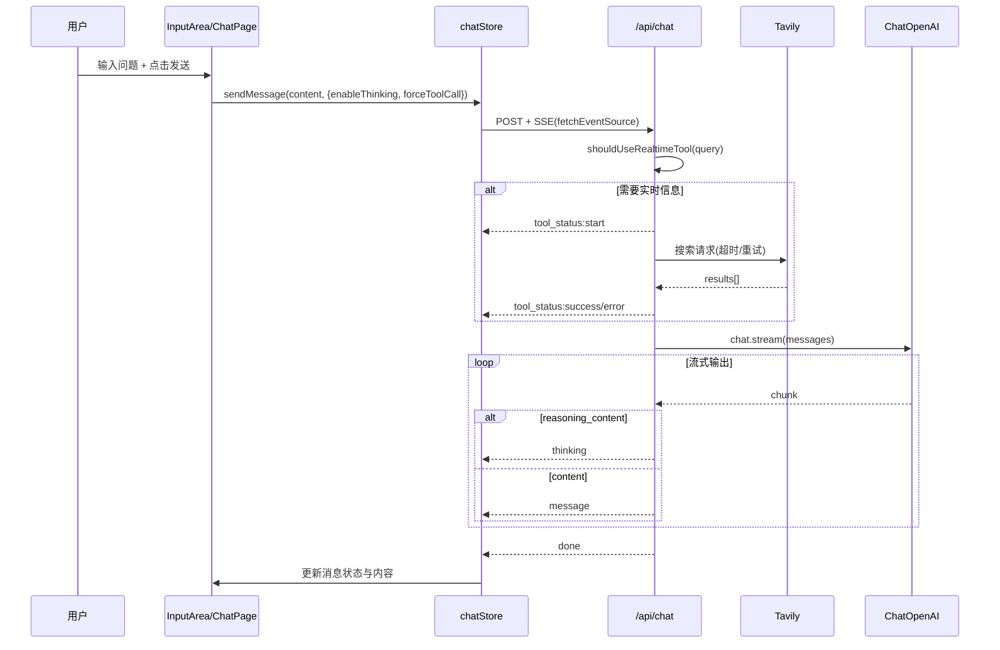

# AI 意图解析与工具调用技术说明（阶段二）

> 权威边界：本文档是当前 Agent/SSE/ThoughtChain 运行链路的说明入口，描述现有实现如何从用户输入流转到工具调用、thinking 透传、SSE 事件和前端状态展示。更早的阶段二设计文档属于历史方案或未来演进参考；若与当前代码或本文档冲突，应先核对实现，再更新本文档或补充新的正式决策。

## 1. 文档目标
本文说明当前项目中，AI 对话从“用户输入”到“模型流式输出”的完整链路，重点覆盖：
- 用户意图如何被解析并触发实时工具调用
- 深度思考（thinking）如何触发与透传
- Tavily 工具调用与降级逻辑
- 前后端 SSE 协议与 UI 状态展示（ThoughtChain）
- 关键实现细节与可扩展方案

## 2. 总体架构与职责

职责划分：
- 前端输入与会话管理：`InputArea` + `ChatPage` + `chatStore`
- 决策与工具调度：`api/lambda/chat/index.ts`
- 展示层：`MessageList`（`Think`、`ThoughtChain`、Markdown）

## 3. 端到端时序

## 4. 用户意图解析与决策逻辑

### 4.1 输入面参数
前端发送字段（`chatStore.sendMessage`）：
- `content`: 用户输入
- `enableThinking`: 是否开启深度思考
- `forceToolCall`: 是否强制工具调用（“重查工具”场景）

### 4.2 意图判断（规则式）
后端通过 `shouldUseRealtimeTool(query)` 做第一层判定：
- 时间实时词：如“今天/明天/当前/最新/实时”
- 环境状态词：如“天气/温度/降雨/空气质量”
- 营业拥挤词：如“开放/排队/人流/门票/预约”

判定公式：
- `shouldCallTool = forceToolCall || shouldUseRealtimeTool(query)`

### 4.3 决策分支
- 分支 A（调用工具）：
  - 发送 `tool_status:start`
  - 调 Tavily，裁剪结果并格式化为可注入上下文
  - 成功发送 `tool_status:success`，失败发送 `tool_status:error`
- 分支 B（不调用工具）：
  - 直接进入模型流式回答

## 5. 深度思考与工具调用触发机制

### 5.1 深度思考触发
- 前端通过 `enableThinking` 控制
- 后端在 `ChatOpenAI` 中注入：
  - `modelKwargs.enable_thinking = true`
  - `modelKwargs.return_reasoning = true`

### 5.2 thinking 事件透传
流式 chunk 解析规则：
- 若存在 `chunk.additional_kwargs.reasoning_content`，发 `thinking` 事件
- 若存在 `chunk.content`，发 `message` 事件

前端展示策略：
- `thinking` 聚合到 `thinkingContent`，用 `Think` 组件折叠展示
- `message` 聚合到正文，使用 Markdown 渲染

## 6. Tavily 工具调用技术方案

### 6.1 调用配置（服务端）
- `TAVILY_API_KEY`：必填
- `TAVILY_API_URL`：默认 `https://api.tavily.com/search`
- `TAVILY_SEARCH_MAX_RESULTS`：默认 5
- `TOOL_CALL_TIMEOUT`：默认 10000ms
- `TAVILY_RETRY_TIMES`：默认 1

### 6.2 请求与治理
- 请求体含 `query / max_results / search_depth / topic`
- 超时控制：`AbortController + setTimeout`
- 重试机制：失败按 `TAVILY_RETRY_TIMES` 重试
- 安全日志：`maskSensitiveError` 脱敏
- 上下文裁剪：
  - 标题、正文、URL 限长
  - 防止上下文过长影响模型稳定性

### 6.3 与模型融合
- 将工具结果注入到单一 `SystemMessage` 中（避免多系统消息兼容问题）
- 工具失败时附加“降级提示指令”，要求模型给基础建议

## 7. SSE 协议与前端映射

### 7.1 事件定义
- `tool_status`: 工具状态（`start/success/error/abort`）
- `thinking`: 深度思考内容
- `message`: 模型正文 token
- `done`: 生成完成

### 7.2 前端状态映射
- `tool_status.start -> ToolCallTrace.status = loading`
- `tool_status.success -> success`
- `tool_status.error -> error`
- `tool_status.abort -> abort`

UI 呈现：
- `ThoughtChain` 展示工具链状态
- 消息尾部显示“任务完成/生成失败/已手动终止”
- 若存在 `toolTrace`，展示“重查工具”按钮并触发 `forceToolCall=true`

## 8. 中断与异常处理（稳定性要点）

后端关键策略：
- `safeEmitSse`：对已关闭流写入进行保护，避免 `ERR_INVALID_STATE`
- `safeClose`：幂等关闭，防止重复 close
- `isAborted` + `request?.signal?.aborted`：中止时发送 `abort` 并停止后续写入
- 非中止异常：返回兜底文案并安全收尾

前端关键策略：
- `AbortController` 按会话维度管理
- 新请求前先 `stopMessage` 中止旧请求
- `AbortError` 视为正常中断，不弹错误

## 9. 核心实现文件（当前代码）
- 后端决策与流式：`api/lambda/chat/index.ts`
- 前端请求与状态机：`src/stores/chatStore.ts`
- 页面编排与发送/中止：`src/routes/components/ChatPage/index.tsx`
- 消息渲染与工具链展示：`src/routes/components/MessageList/index.tsx`
- 类型定义：`src/types/session.ts`

## 10. 可扩展实现方案（下一步）

### 10.1 从规则式升级为多节点决策
建议演进为三层策略：
1. 规则层（高优先级快速判定）
2. 轻量分类器层（意图分类 + 置信度）
3. LLM 裁决层（边界问题兜底）

收益：
- 降低误触发工具概率
- 提升复杂问法召回率

### 10.2 工具编排扩展
在 Tavily 之外新增天气/地图工具时，保持统一协议：
- 输入：`toolName + normalizedParams`
- 输出：`ToolCallTrace + normalizedResult`
- 事件：复用 `tool_status/thinking/message/done`

### 10.3 观测与治理
- 指标：工具触发率、成功率、超时率、降级率、平均耗时
- 日志：按会话与消息 ID 关联
- 保护：频控、熔断、灰度开关

## 11. 总结
当前阶段二实现已形成“可解释、可观测、可降级”的工具调用闭环：
- 通过规则判定触发工具
- 通过 SSE 将决策过程透明化（ThoughtChain）
- 通过深度思考事件与工具结果融合提升回答质量
- 通过安全发送与幂等收尾保障流式稳定性
