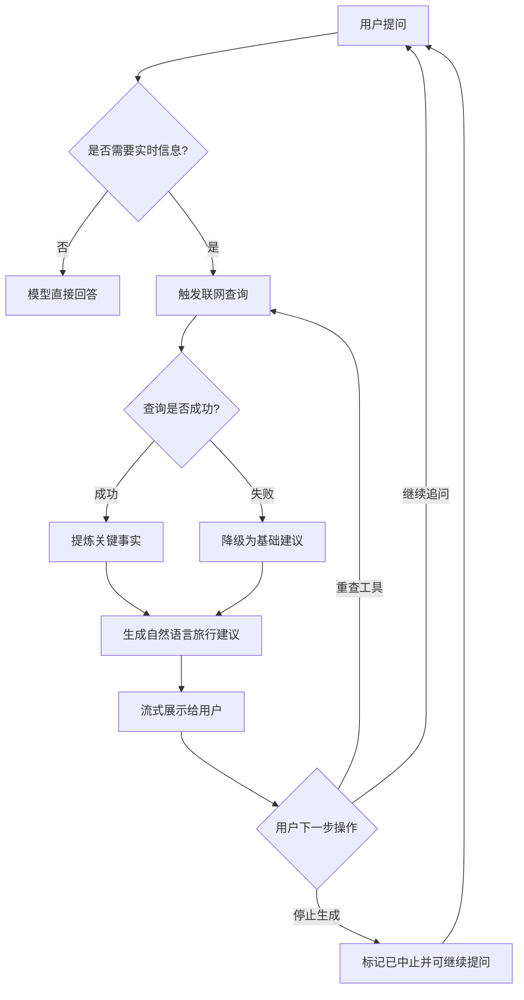

# 阶段二反向 PRD（非技术版）

## 1. 这份文档解决什么问题
这是一份给产品、运营、设计、业务同学看的“反向 PRD”。  
它基于已有的阶段规划与实现现状，讲清楚旅行助手在阶段二要达成的闭环价值：
- 用户提问后，系统能判断是否需要“联网”
- 需要联网时，自动调用工具拿到实时信息
- 最终输出不是原始数据，而是可执行的旅行建议
- 失败时有兜底，不会卡死或无响应

## 2. 目标与边界（结合 `todo.md`）

### 2.1 阶段二目标（做什么）
- 从“只会模型直答”升级为“会判断、会联网、会融合回答”的智能助手
- 聚焦 `Function Call` 工具调用能力
- 保持阶段一已有体验：流式输出、可中止、消息可读

### 2.2 阶段二不做什么（暂不做）
- 不做长期记忆与数据库持久化（放到阶段三）
- 不做知识库 RAG（放到阶段三）
- 不做生成式组件级 UI（放到阶段四）

## 3. 用户价值（为什么要做）
- 用户问“实时问题”时，不再靠模型猜，答案更可信
- 用户能看到“正在查询中”，体验更透明
- 用户能“重查工具”，降低一次失败带来的挫败
- 即使工具失败，也能拿到基础建议，不会断对话

## 4. 核心用户场景
- 场景 A：出发前即时决策  
  例：“我明天去北京，天气和景点开放情况怎样？”
- 场景 B：行程中临时调整  
  例：“上海迪士尼今天人多吗，要不要改去别处？”
- 场景 C：失败兜底  
  例：网络异常时，系统提示“暂时无法获取实时信息，为你提供基础建议”

## 5. 产品闭环（箭头版）

用户输入问题  
→ 系统判断是否为“实时问题”  
→ （是）触发联网工具查询  
→ 返回候选信息并做可信筛选  
→ AI 融合成旅行建议  
→ 前端流式展示（含“查询中/成功/失败”状态）  
→ 用户可点赞/复制/重查工具  
→ 新一轮问题继续进入同一闭环

## 6. 全链路流程图（产品视角）

## 7. 阶段二能力拆解（对应设计文档与 todo）

### 7.1 能力一：智能触发工具
- 系统识别“今天/明天/实时/排队/开放/天气”等实时意图
- 非实时问题走直答，避免每次都联网导致慢和贵

### 7.2 能力二：工具结果融合
- 不把原始搜索结果直接扔给用户
- 由 AI 将“事实”整理成“建议”
- 输出风格保持旅行助手口吻（可执行、可理解）

### 7.3 能力三：状态可感知
- 用户能看到：
  - 正在查询
  - 查询成功（检索到几条）
  - 查询失败（已降级）
  - 已中止

### 7.4 能力四：可恢复、可重试
- 消息右下角可“重查工具”
- 中途停止后，不影响下一次提问
- 工具失败自动降级，不会整段对话报废

## 8. 关键交互设计（非技术描述）

### 8.1 输入区
- 支持普通发送
- 支持“深度思考”开关
- 支持“停止生成”

### 8.2 消息区
- AI 正常回复按打字机流式出现
- 若触发联网，会出现“工具调用状态链”
- 完成态显示“任务完成/生成失败/已手动终止”

### 8.3 操作区
- 复制、反馈
- 有工具链时展示“重查工具”

## 9. 失败处理与体验兜底

### 9.1 用户可见兜底
- 出错时给出明确提示，不抛技术错误给用户
- 提示语统一、可理解

### 9.2 业务兜底原则
- “宁可降级有建议，也不沉默”
- “宁可稍慢一点，也要结果可信”

## 10. 阶段二验收标准（产品口径）

### 10.1 功能验收
- 实时问题能触发联网，非实时问题不误触发
- 回复中包含实时信息且表述自然
- 工具失败时自动降级，页面不中断
- 用户可通过“重查工具”发起再次查询

### 10.2 体验验收
- 用户能感知当前系统状态（查询中/成功/失败/中止）
- 流式体验连续，无明显断层
- 同一会话中可连续多轮提问，不出现“卡死”

### 10.3 业务验收
- 相比阶段一，实时问题满意度提升
- 因“答非所问/信息过期”导致的负反馈下降

## 11. 与后续阶段的衔接（全局闭环）

### 11.1 阶段三（MCP/Skills + RAG）
- 在阶段二工具闭环上，增加“知识库”与“个性化记忆”
- 目标是从“会查实时”升级到“会记住你、会查本地专属知识”

### 11.2 阶段四（生成式 UI）
- 在阶段二文本闭环上，升级为“文字 + 可视化组件闭环”
- 目标是从“给建议”升级到“可交互地修改行程”

## 12. 一句话总结
阶段二的本质，不是“接了一个搜索 API”，而是把旅行助手做成一个可感知、可恢复、可持续追问的产品闭环：  
**能判断是否需要联网 → 能查到实时信息 → 能把信息转成建议 → 能在失败时优雅降级 → 能支持用户继续下一步操作。**

